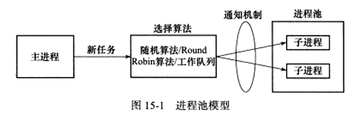
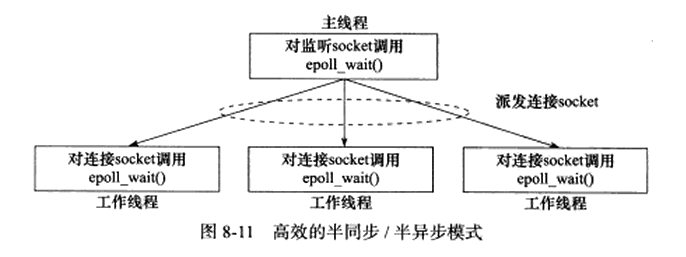
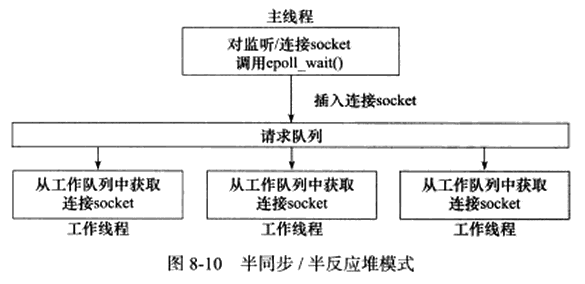

<!--
 * @Author: your name
 * @Date: 2021-01-25 16:30:30
 * @LastEditTime: 2021-01-26 15:30:59
 * @LastEditors: Please set LastEditors
 * @Description: In User Settings Edit
 * @FilePath: \LinuxServerCodes\15\learnbook.md
-->
# 15 进程池和线程池
动态的创建子进程（子线程）来实现并发服务器，这将会导致效率低下。

## 15.1 进程池和线程池概述
- 进程池是由服务器预先创建的一组子进程，这些子进程的数目在3-10个之间。
- 进程池中的所有子进程都运行着相同的代码，并具有相同的属性，比如优先级、PGID等
- 当有新任务到来时，主进程将通过某种方式选择进程池中的某个子进程为其服务，主要有两种。
  - 主进程使用某种算法主动选择子进程，比如随机算法和Round Robin算法
  - 主进程和所有子进程通过一个共享的工作队列来同步，主进程往工作队列中添加任务，子进程从中取任务。
  - 父子进程间通信一般用管道，线程间通信一般用全局变量

总结如下图
  

# 15.2 处理多客户

# 15.3 半同步/半异步进程池实现

# 15.5 半同步/半反应堆线程池实现
相比于前述的进程池实现，该线程池的通用性要高得多，因为它使用一个工作队列完全解除了主线程和工作线程的耦合关系。主线程往工作队列中插入任务，工作线程通过竞争来取得任务并执行之。

