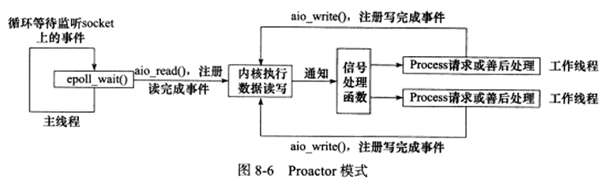

<!--
 * @Author: your name
 * @Date: 2021-01-19 17:05:02
 * @LastEditTime: 2021-01-20 15:22:27
 * @LastEditors: Please set LastEditors
 * @Description: In User Settings Edit
 * @FilePath: \LinuxServerCodes\8\learnbook.md
-->
# 8
- I/O处理单元。主要包括I/O处理单元的四种I/O模型和两种高效事件处理模块
- 逻辑单元 包括逻辑单元的两种高效并发模式以及搞笑的逻辑处理方式——有限状态机
- 存储单元
## 8.1 服务器模型
服务器模型主要包括C/S(client/server)模型和P2P(peer to peer)模型

服务端和客户端之间的状态转移如下图所示

## 8.2 服务器编程模型
服务器程序种类繁多但是基本框架一样，不同之处在于逻辑处理，如下图所示。

- IO处理单元是服务器管理客户连接的模块。
- 一个逻辑单元通常是一个进程或线程，来分析处理客户数据并作出响应
- 网络存储单元可以是数据库、缓存和文件，甚至一台服务器
- 请求队列是各单元之间的通信方式的抽象。

## 8.3 IO模型

阻塞和非阻塞的概念能应用于所有文件描述符而不仅仅是socket，我们称阻塞的文件描述符为阻塞IO，非阻塞的文件描述符为非阻塞IO。针对阻塞IO执行的系统调用因为无法立即完成而被操作系统挂起，针对非阻塞IO执行的系统调用则总是立即返回而不管事件是否已经发生。

socket的基础API中可能被阻塞的系统调用包括accept、send、recv、connect。

非阻塞IO通常要和其他IO通知机制一起使用，比如IO复用和SIGIO信号。阻塞IO、IO复用和信号驱动IO都是同步模型，因为这三种IO模型IO的读写操作都是IO事件发生后由应用程序来完成的。

同步IO模型要求用户代码自行执行IO操作（将数据在内核缓冲区和用户缓冲区之间读写）；异步IO机制则由内核来执行IO操作。总结如下图

## 8.4 两种高效的时间处理模型
服务器程序通常需要处理IO事件、信号及定时事件三类事件。
### Reactor模式

同步IO模型通常用于实现Reactor模式，如下图所示

### Proactor模式

异步IO模型则用于实现Proactor模式,如下图所示

## 两种高效的并发模式
### 半同步/半异步模式
在IO模型中，同步和异步区分的是由谁来完成IO读写（是应用程序还是内核）
在并发模式中，同步指的是程序完全按照代码序列的顺序执行，异步指的是程序的执行需要由系统时间来驱动。两者是完全不同的概念。

半同步/半异步模式的工作流程如下图所示

### 领导者/追随者模式
领导者/追随者模式是多个工作线程轮流获得事件源集合，轮流监听、分发并处理事件的一种模式
## 有限状态机
有限状态机在这里指逻辑单元内部的一种高效编程方法。

### 池、数据复制、上下文切换和锁

为提高服务器性能，以空间换时间，即浪费服务器的硬件资源以换取其运行效率，这就是池的概念。主要包括内存池、进程池和连接池，内存池通常用于socket的接受缓存和发送缓存；进程池和线程池是并发编程的常用方法，提前将进程或线程初始化从而减少创建进程和线程的时间；连接池通常用于服务器或服务器机群的内部永久链接。

高性能服务器应该避免不必要的数据复制，尤其当数据复制发生在用户代码和内核之间时。

并发程序必须考虑上下文切换的问题，即进程切换或线程切换导致的系统开销。

