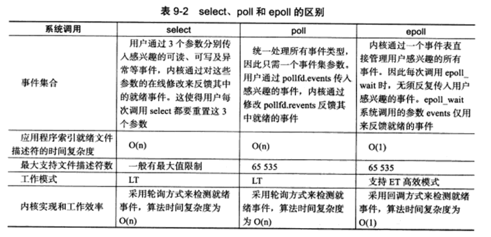

<!--
 * @Author: your name
 * @Date: 2021-01-21 16:49:46
 * @LastEditTime: 2021-01-21 17:29:56
 * @LastEditors: Please set LastEditors
 * @Description: In User Settings Edit
 * @FilePath: \LinuxServerCodes\9\learnbook.md
-->
# 9 IO复用

IO复用使得程序能同时监听多个文件描述符，这对提高程序的性能至关重要。IO复用虽然能同时监听多个文件描述符，但它本身是阻塞的。并且当多个文件描述符同时就绪时，如果不采取额外措施程序就只能按顺序依次处理。

## 9.1 select
select的用途是在一段指定时间内，监听用户感兴趣的文件描述符上的可读、可写和异常等事件。
```C++
int select(int nfds,fd_set* readfds,fd_set* writefds,fd_set* exceptfds,struct timeval* timeout)
```

## poll

poll系统调用和select类似，也是在指定时间内轮询一定数量的文件描述符，以测试其中是否有就绪者。

## epoll

## 三者对比


